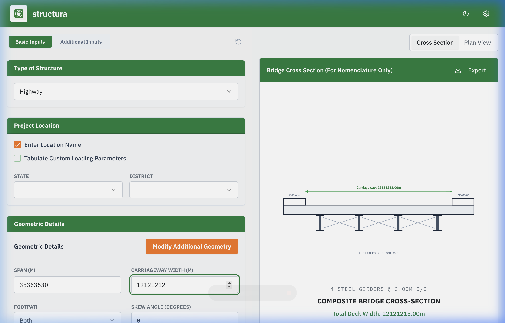
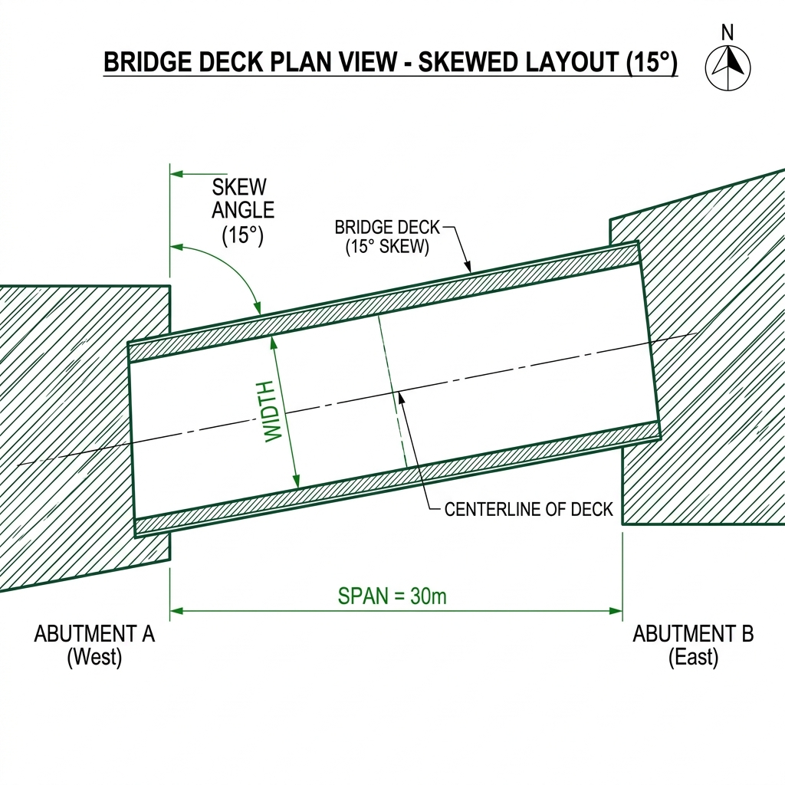

# Structura: Advanced Bridge Deck Designer

[](https://structura-osdag-2026.web.app)
[](https://react.dev)

##  Project Overview
**structura** is a high-fidelity, professional bridge design and analysis platform developed for **Osdag**. It transforms complex engineering parameters into reactive, real-time visual diagrams (Cross-Sections and Plan Views) following strict IRC (Indian Roads Congress) standards.

The application is designed to provide structural engineers with an intuitive, spreadsheet-free workflow for bridge superstructure geometry validation and expert parameter adjustment.

---

##  Live Demo
Visit the live application here:
### [** Launch structura Project**](https://structura-osdag-2026.web.app)

---

## 📊 Project Visuals

### 1. Composite Bridge Cross-Section
The 'Cross Section' view provides a detailed engineering drawing of the girders, deck, and footpaths, reactive to your width and spacing inputs.


### 2. Bridge Deck Plan View (Skewed)
The 'Plan View' visualizes the orientation of the bridge deck, tilting in real-time based on the Skew Angle ($ -45^\circ $ to $ +45^\circ $).


---

##  Tech Stack

### Frontend
- **Framework**: [React](https://reactjs.org/) (TypeScript)
- **Build Tool**: [Vite](https://vitejs.dev/) for ultra-fast development and optimized production builds.
- **Styling**: [Tailwind CSS](https://tailwindcss.com/) for a modern, responsive design system.
- **Components**: [Shadcn UI](https://ui.shadcn.com/) (Radix UI) for accessible, high-performance UI primitives.
- **Icons**: [Lucide React](https://lucide.dev/) for consistent, professional iconography.

### Engineering & Visualization
- **Drawing Engine**: Reactive **SVG** (Scalable Vector Graphics) for real-time reactivity to engineering state changes.
- **Export**: [html2canvas](https://html2canvas.hertzen.com/) and [jsPDF](https://parall.ax/products/jspdf) for high-resolution PNG and PDF diagram generation.

### Backend & Deployment
- **API**: [Django](https://www.djangoproject.com/) (REST Framework) for engineering validation and location data.
- **Hosting**: [Firebase Hosting](https://firebase.google.com/docs/hosting) for global, high-performance delivery.

---

##  Architecture

### 1. Centralized State Manager (`Index.tsx`)
The application uses **Lifted State** to maintain a single source of truth for all bridge parameters (Span, Width, Skew, etc.). This ensures that all visual drawings and summary data remain perfectly synchronized in real-time.

### 2. Reactive Drawing Engine (`BridgeDrawings.tsx`)
A custom SVG engine that dynamically recalculates coordinates, dimensions, and labels based on the active engineering state.
- **Cross-Section View**: Dynamically renders girder spacing, overwrites, and footpath placement.
- **Plan View**: Real-time skew angle tilting and span visualization.

### 3. Expert Geometry Modal (`AdditionalGeometryModal.tsx`)
A dedicated expert-mode interface that handles complex mathematical constraints between overall width, girder count, and spacing, ensuring that all expert inputs remain physically valid.

### 4. Security & Environment Layer
All backend API endpoints and sensitive configurations are managed via a robust **Environment Variable (`.env`) system**, keeping the source code clean and secure for public repositories.

---

##  Getting Started

### Prerequisites
- Node.js (v18+)
- npm or bun

### Setup
1. **Clone the repository**:
   ```bash
   git clone https://github.com/tanusingh04/bridge_designer_osdag.git
   cd bridge_designer_osdag
   ```

2. **Install dependencies**:
   ```bash
   npm install
   ```

3. **Configure Environment Variables**:
   Copy the example environment file and update the API locations as needed:
   ```bash
   cp .env.example .env
   ```

4. **Run Development Server**:
   ```bash
   npm run dev
   ```

---

##  Deployment
The project is configured for one-click deployment to Firebase:
```bash
npm run build
firebase deploy
```

---

## 📄 License
This project is part of the **Osdag Summer Fellowship 2026**. All rights reserved.
